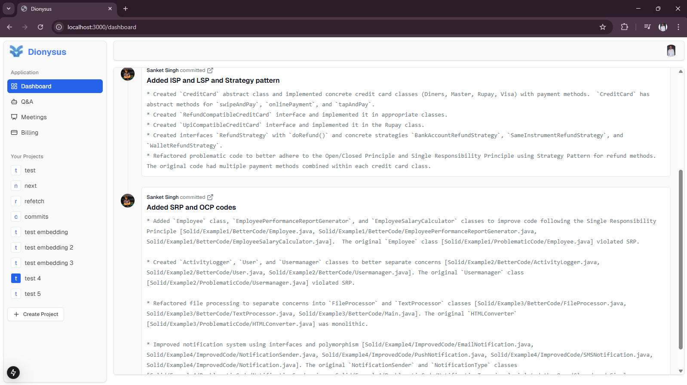
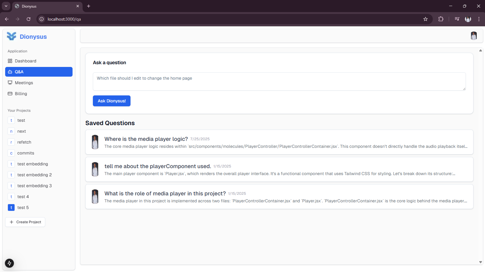
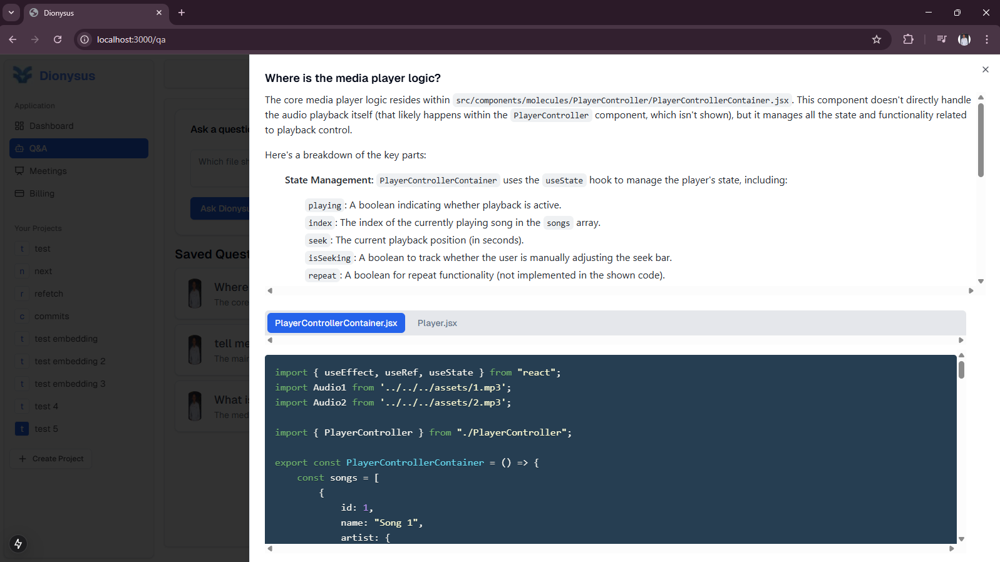
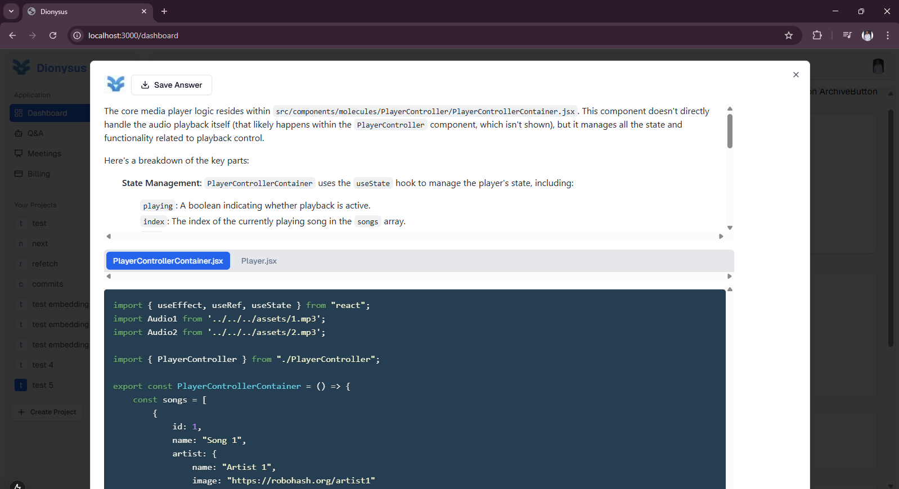
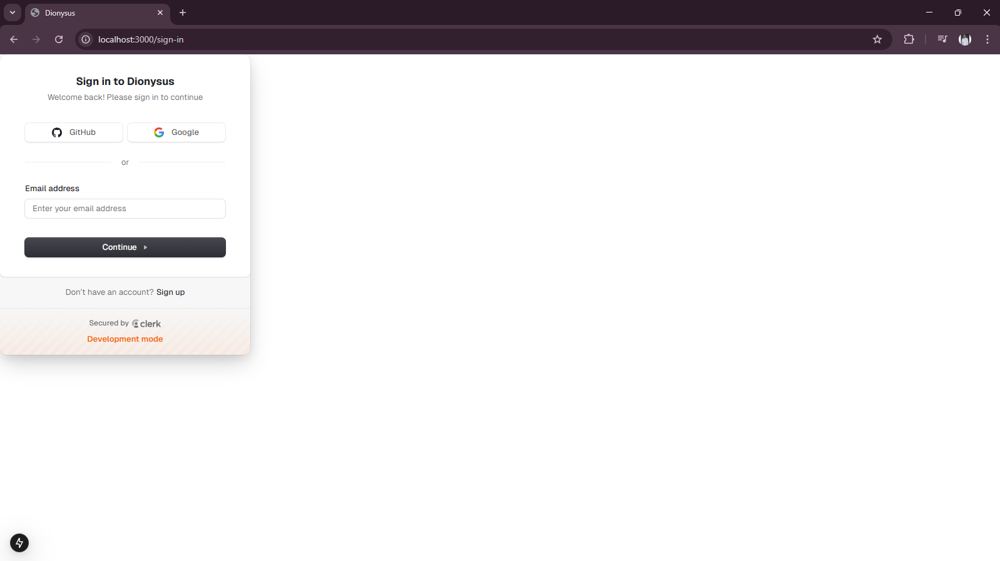

# 🎧 Dionysus – AI-Powered Codebase Navigator

> An intelligent developer assistant that helps you explore your codebase using Generative AI.

---

## 📌 Overview

- 🧠 **Dionysus** is a full-stack AI-powered dashboard built for modern engineering teams.
- 🔍 Ask natural-language questions about your GitHub codebase and get accurate, file-specific answers.
- 📁 Auto-indexes repositories and commits with detailed insights.
- 🧠 Powered by Large Language Models (LLMs), LangChain, and RAG-based retrieval for contextual responses.

---

## 🚀 Features

### ✅ GitHub Dashboard
- Displays your GitHub repository commits in real time.
- Rich markdown formatting for commit messages.
- Extracts and displays applied design patterns or refactor insights (e.g., SOLID principles).
- Repository management with support for multiple projects.
- 
- 

### 🤖 AI Q&A System (Codebase GPT)
- Ask technical questions like:
  - _“Where is the main routing logic implemented?”_
  - _“Explain the use of tRPC in this project.”_
- Answers include:
  - **Referenced file names**
  - **Explanation with reasoning**
  - **Syntax-highlighted code snippets**
- Maintains a history of questions and answers per project.
- 
- 

### 📚 Retrieval-Augmented Generation (RAG)
- Implements **RAG architecture** to enhance answer quality by combining LLMs with context-aware document retrieval.
- 🔎 **LangChain** is used to:
  - Chunk and embed source code files.
  - Store vectors in a retrievable format.
  - Fetch top-matching chunks based on semantic similarity.
- 🧠 LLMs then generate responses grounded in the retrieved context, improving precision and traceability.
- Ensures that answers are not hallucinated but based on actual codebase content.
- 

### 🔐 Authentication
- Built-in authentication using **Clerk**.
- Supports login via GitHub, Google, or email.
- Protected routes for authenticated users.
- 

---

## 🧱 Tech Stack

### 📦 Frontend
- **Framework**: Next.js 15 with App Router
- **React**: React 18 + Server Components
- **Styling**: Tailwind CSS + ShadCN + Radix UI
- **Icons**: Lucide-react
- **Forms**: React Hook Form, `usehooks-ts`
- **Markdown Editor**: `@uiw/react-md-editor`

### 🤖 AI Integration
- **AI SDKs**: `@ai-sdk/google`, `@google/generative-ai`, `@langchain/*`
- **LLM Usage**: RAG-based architecture for contextual answers
- **Embedding & Chunking**: Efficient source file parsing for accurate context retrieval

### 🧠 Backend
- **API**: tRPC (type-safe API across frontend/backend)
- **ORM**: Prisma with PostgreSQL
- **Auth**: Clerk for user management
- **Storage**: Firebase Storage (for future use)

---

## 🗃️ Project Structure Highlights

<details>
<summary>Directory Tree</summary>

```bash
/components
  └── ui/                                  # Reusable UI components
  └── dashboard/                           # Commit list and markdown viewer
  └── qa/                                  # Q&A interface and result viewer

/app
  ├── dashboard/                           # GitHub commit dashboard
  ├── qa/                                  # AI-powered Q&A system
  ├── auth/                                # Clerk login/signup handling
  ├── api/                                 # Backend endpoints and tRPC routers
